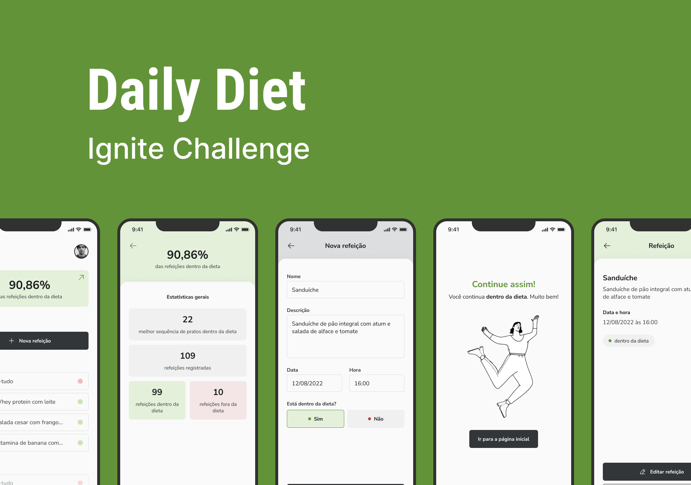
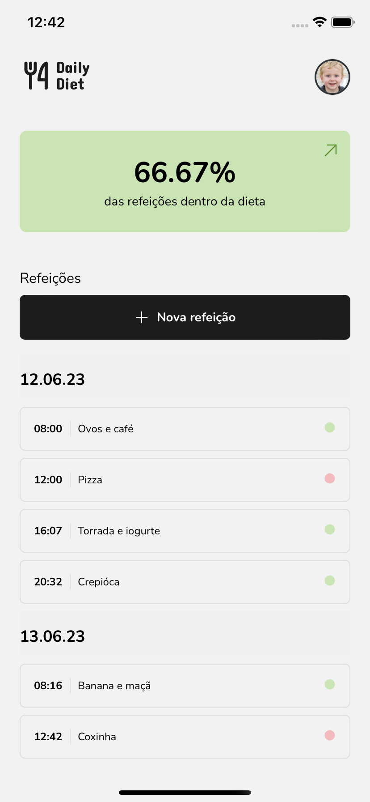
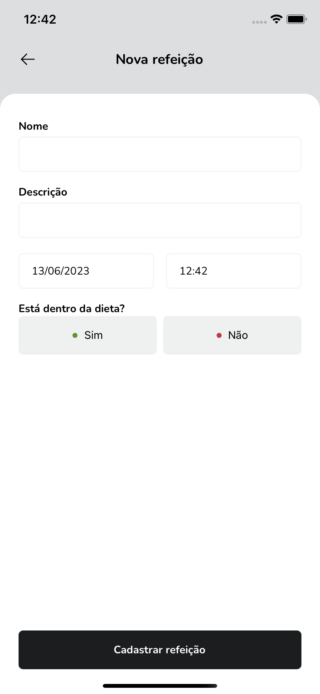
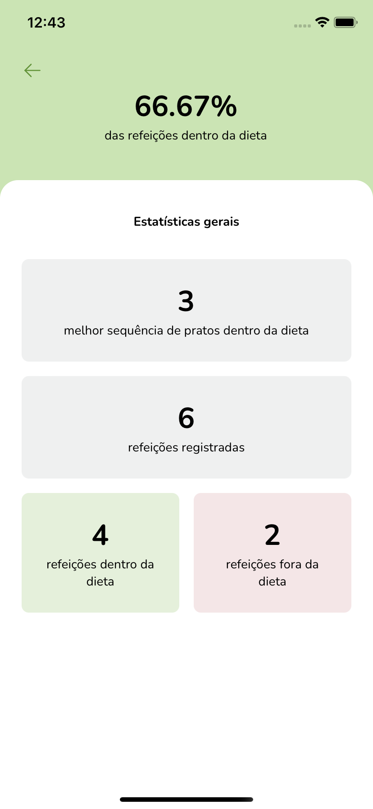
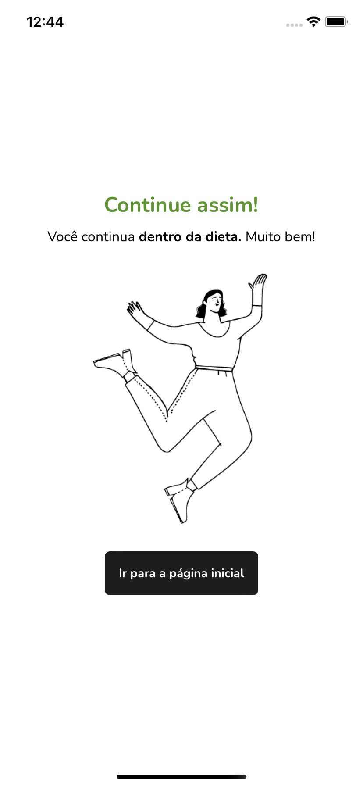
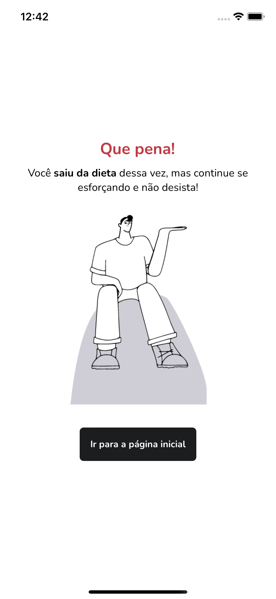

# **Daily diet**



## **Description**

This application was developed during the [course Ignite](https://www.rocketseat.com.br/ignite).
The application was created using Expo, and CSS-in-JS (styled-components) was used for component styling. <br /><br />
The application is a meal tracker that enables users to register their daily meals and indicate whether each meal is within or outside their dietary plan. It also provides statistics and insights on the overall diet, giving users an overview of their eating habits.<br />

## **Screenshots**

<div>





</div>

## **Prerequisites**

Set up the necessary environment for developing a React Native application using Expo. You can do this according to the official [documentation](https://reactnative.dev/docs/environment-setup?guide=quickstart).

## **Instalation**

```bash
# Clone the project
$ git clone https://github.com/leandrodsi/daily-diet.git

# Access the folder
$ cd daily-diet

# Install the dependencies
$ npm install

# Start the project
$ npm start

```

## **Contribution**

The project was developed for learning purposes only. If you want to contribute with any improvement (code or idea) or provide constructive criticism, feel free to use the [issues](https://github.com/leandrodsi/ignite-gym/issues) tab.

## **Contact**

📞 <a href="tel:+351933968325">+351 933 968 325</a> <br />
 ✉️ <a href="mailto:leandrodsystems@gmail.com">leandrodsystems@gmail.com</a>
